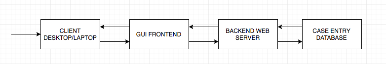

## 5.0	Requirements Specification

## 5.1	Introduction
This Software Requirements Specification (SRS) documents the requirements for the Los Angeles Police Department (LAPD) Database Web Application called
CrookBook. The CrookBook Database is a relational database that will allow LAPD
to enter in and find police case data with ease. The procedure will be done across the Internet from a desktop computer or laptop and the application is built and tailored for the needs of LAPD. The application is meant to provide authorized LAPD personnel data reports that indicate cases that are worthwhile investigating. The Web Application will be built with a three-tier client/server architecture. So at a high level, the user will be interacting with a Graphical User Interface completed by a frontend framework. The backend will be the connection that brings together the frontend and the database. It will handle all server requests from the frontend and be able to distinguish if accessing the database is needed. The relational database used will store all case entries and will be fully reliable to work with concurrent access between two or more users.

	

The following table defines the language used in specifying requirements in this document. Only 'shall' statements are explicit requirements for this project.

| Type   | Definition                                    |
|--------|-----------------------------------------------|
| Shall  | Expresses mandatory provision.                |
| Should | Expresses non-mandatory provision.            |
| Will   | Declaration of purpose such as a design goal. |

## Document Outline
- 5.2	CSCI Component Breakdown
- 5.3	Functional Requirements by CSC
- 5.4	Performance Requirements by CSC
- 5.5	Project Environment Requirements
	- 5.5.1	Development Environment Requirements
	- 5.5.2	Execution Environment Requirements

### 5.2 	CSCI Component Breakdown
CSCI CrookBook is composed of the following CSCs:

- 5.2.1	**GUI Client CSC**:  Web based portal to CrookBook
  - 5.2.1.1	**Cases Table CSU**: Displays list of the top priority cases
  - 5.2.1.2	**Search Cases Form CSU**: Form used to search existing CrookBook cases
  - 5.2.1.3	**Add New Case Page CSU**: Form used to add new case to CrookBook
  - 5.2.1.4 **Edit Existing Case Page CSU**: Ability to edit an existing case in CrookBook
  - 5.2.1.5	**Login Page CSU**: Webpage containing login form
  - 5.2.1.6 **User Profile Page CSU**: Webpage containing user status permissions
  - 5.2.1.7	**Detailed Case Info Page CSU**: Page for each entry in CrookBook database that displays all case information
  - 5.2.1.8	**Navigation Bar CSU**: Navigation bar used on every page in CrookBook

- 5.2.2 **QR System CSC**: QR system used for each physical case binder
  - 5.2.2.1	**QR Code Printer CSU**: Small QR code printer
  - 5.2.2.2	**QR Code Reader CSU**: Mobile QR code reader
  - 5.2.2.3	**Murder Book Info Page CSU**: Displays information about each physical case binder

- 5.2.3 **Backend Server CSC**: Server that maintains the GUI Client
  - 5.2.3.1 **NodeJS modules CSU**: package that handle requests to connect Frontend middleware static files (CSS and Scripts)

- 5.2.4 **Database CSC**: Database that stores all the case information
	- 5.2.4.1 **Querying CSU**: package that allow querying all existing data
	- 5.2.4.2 **Indexing CSU**: package that indexes the data
	- 5.2.4.3 **History CSU**: package that backs up the database periodically (Need to decide how this is done. By month, week etc.)

### 5.3	Functional Requirements
#### 5.3.1	GUI Client CSC
- 5.3.1.1 The GUI subsystem shall display a window for the main application.
- 5.3.1.2 The GUI subsystem shall react to mouse clicks on displayed buttons.
- 5.3.1.3 The GUI subsystem shall react to typing within displayed text fields.
- 5.3.1.4 The GUI subsystem shall display both the cases table module and search form module on one webpage
- 5.3.1.5 The GUI subsystem shall use Hyper Text Markup Language (HTML)
- 5.3.1.6 The GUI subsystem shall allow an Administrator and Detectives read and write access
- 5.3.1.7 The GUI subsystem shall allow normal users read access
- 5.3.1.8 The GUI subsystem should include 4 separate pages
- 5.3.1.9 The GUI subsystem should include instructions for use when needed
- 5.3.1.10 One GUI subsystem page shall contain the cases table CSU, search cases form CSU, and navigation bar CSU (aka the dashboard)
- 5.3.1.11 The second GUI subsystem page shall contain exclusively the login page CSU and navigation bar CSU
- 5.3.1.12 If the user is not authenticated, the login page will always appear
- 5.3.1.13 The third GUI subsystem page shall contain the detailed case info page CSU and navigation bar CSU
- 5.3.1.14 The fourth GUI subsystem page will display the current user's profile and permissions (read, write)
- 5.3.1.15 The fourth GUI subsystem page will have an option to give another user write access if the current user is an administrator
- 5.3.1.16 The cases table CSU should display the most commonly used information on cases
- 5.3.1.17 The cases table CSU should have the highest priority cases on top
- 5.3.1.18 The cases table CSU entries will be large and legible
- 5.3.1.19 The cases table CSU should have an edit button next to each entry if the user has write access
- 5.3.1.20 The cases table CSU should have an upload CSV file button
- 5.3.1.21 The GUI subsystem shall display a modal window for user to confirm changes that will be made
- 5.3.1.22 The cases table CSU entries should link to each corresponding detailed case info page for each entry
- 5.3.1.23 The search cases form CSU shall use some combination of text fields and buttons
- 5.3.1.24 The search cases form CSU shall include options necessary to enter any amount of search criteria needed to find murder cases
- 5.3.1.25 The login page CSU shall have a username input field
- 5.3.1.26 The login page CSU shall have a password input field
- 5.3.1.27 The login page shall have a login button
- 5.3.1.28 The login page shall redirect to another page if the user is successfully authenticated
- 5.3.1.29 The login page shall not appear if the user is currently logged in
- 5.3.1.30 *If* the user remains inactive for some time, the GUI subsystem shall log the user out
- 5.3.1.31 The detailed case info page CSU shall display all information that has been entered for that case
- 5.3.1.32 The detailed case info page shall include empty headings for information not entered
- 5.3.1.33 The detailed case info page shall include edit buttons next to each entry if the user has write access
- 5.3.1.34 The detailed case info page shall include a history log button for each entry
- 5.3.1.35 The history log button shall retrieve a list of changes made to entry and by whom
- 5.3.1.36 Each case will have a unique detailed case info page URL
- 5.3.1.37 The detailed case info page will contain links to the corresponding murder book info page(s) if the murder book has been entered into the QR system
- 5.3.1.38 The navigation bar shall have a link to the dashboard
- 5.3.1.39 The navigation bar will have a link to the add cases page
- 5.3.1.40 The navigation bar will have a link to the current user's profile page
- 5.3.1.41 The navigation bar will have a link to logout and back to the login page
- 5.3.1.42 *If* the QR Code System CSC is implemented, the GUI subsystem will include the murder book info page CSU

#### 5.3.2	QR Code System CSC
Note: The entire barcode system CSC is **not** a mandatory provision; therefore, all functional requirements will say 'should' or 'will'

- 5.3.2.1 The QR code printer CSU should be small enough to comfortably carry around
- 5.3.2.2 The QR code printer will be able to print a unique QR Code for each murder book
- 5.3.2.3 The QR code reader will be able to work on any iPhone or android cell phone
- 5.3.2.4 The QR code reader will be an application downloaded from some external source
- 5.3.2.5 The QR code reader will link to the corresponding detailed case info page
- 5.3.2.6 The murder book info page will contain info about when the murder book was last checked out
- 5.3.2.7 The murder book info page will contain info about where the murder book was last checked out
- 5.3.2.8 The murder book info page will contain info about when the murder book is due to be returned
- 5.3.2.9 The murder book info page will contain info about who checked out the murder book
- 5.3.2.10 The murder book info page will contain links to or info from other murder book info pages (if there are multiple volumes for one case)
- 5.3.2.11 The murder book info page will contain info from the corresponding detailed case info page

#### 5.3.3 Backend Server CSC
- 5.3.3.1 The backend server shall serve the correct page from an HTTP request made on the Frontend
- 5.3.3.2 The backend server shall serve present time data from the database given conditionals on the Frontend
- 5.3.3.3 The backend server shall send changes to the database if a case entry is edited
- 5.3.3.4 The backend server shall send a case entry to the database if a case entry is added
- 5.3.3.5 The backend shall handle concurrent requests to the database up to 15 users
- 5.3.3.6 The backend shall send a 404 error code when a page is not found
- 5.3.3.7 The backend shall send a 500 error code when there is an issue with the server
- 5.3.3.8 The backend will notify the Frontend if the database is being backed up
- 5.3.3.9 The backend shall log out a user if they are idle for more than 10 minutes

#### 5.3.4 Database CSC
- 5.3.4.1 The Database shall accept queries on stored data
- 5.3.4.2 The Database shall only be accessible through LAPD personnel and the LAPD CrookBook Web App
- 5.3.4.3 The Database shall have transactions to back up the data
- 5.3.4.4 The Database shall provide snapshots of previous data to only the Database Administrator
- 5.3.4.5 The Database shall prevent concurrent data modification between two or more users
- 5.3.4.6 The Database shall provide a unique key for every case entry
- 5.3.4.7 The Database will perform minimum operations on queried data
- 5.3.4.8 The Database will perform maximum operations on queried data
- 5.3.4.9 The Database will perform arithmetic operations on queried data
- 5.3.4.10 *If* the QR Code System CSC is implemented, the Database will provide a unique key for
every murder book

### 5.4	Performance Requirements
- 5.4.1 Immediate login 
Authenticated users should be able to login and see the home dashboard quickly and with ease.

- 5.4.2 Immediate navigation 
Authenticated users should be able to quickly navigate through every page the CrookBook Web App provides.

- 5.4.3 Quick search results 
The Frontend shall communicate search results within 5 seconds.

### 5.5	Project Environment Requirements

#### 5.5.1	Development Environment Requirements

#### 5.5.2	Execution Environment Requirements
