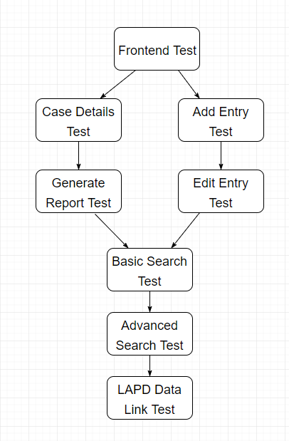

# 10.0 Testing
This document serves to describe the unit testing plan and procedures for the Crookbook project. It contains details about multiple unit tests that are required for Crookbook.

## 10.1 Unit Testing Plan
This document serves to describe the unit testing plan and procedures for the Crookbook project. It contains details about multiple unit tests that are required for Crookbook.

### 10.1.1 Unit Test Descriptions
- 10.1.1.1 Unit Test #1 - Frontend Linking: This test will ensure that each page tab links to the proper page. For example, that the home page tab directs to the home page, or the add entry tab directs to the add entry page.
- 10.1.1.2 Unit Test #2 - Add Entry: This test will ensure that users can add a valid entry into the database.
- 10.1.1.3 Unit Test #3 - Edit Entry: This test will ensure that users are able to edit any case within the database.
- 10.1.1.4 Unit Test #4 - Case Details: This test will ensure that users are able to properly view all the case details within the Case Details page.
- 10.1.1.5 Unit Test #5 - Basic Search: This test will ensure that users are able to search for cases using the basic search functionality.
- 10.1.1.6 Unit Test #6 - Advanced Search: This test will ensure that users are able to search for cases using the advanced search functionality.
- 10.1.1.7 Unit Test #7 - Generate Report: This test will ensure that users are able to generate a PDF document that includes relevant case information.
- 10.1.1.8 Unit Test #8 - LAPD Data Linking: This test will ensure that all the cases from the LAPD's Excel file is integrated into the CrookBook database.

## 10.2 Integration Testing Plan
This document serves to describe the Integration testing plan and procedures for the Crookbook project. It contains details about multiple integration tests that are required for Crookbook.

### 10.2.1 Integration Test Descriptions
- 10.2.1.1 Integration Test #1 - Frontend Linking: This test will throw an error if a link does not direct to the proper page ID.
- 10.2.1.2 Integration Test #2 - Add Entry: This test will throw an error if an entry is not added to the database properly. It will also throw an error if an entry is imputed incorrectly.
- 10.2.1.3 Integration Test #3 - Edit Entry: This test will throw an error if an edit to a case entry is not saved properly.
- 10.2.1.4 Integration Test #4 - Case Details: This test will throw an error if the case details page does not show all the proper case information.
- 10.2.1.5 Integration Test #5 - Basic Search: This test will throw an error if a relevant case is omitted from the search list based on a search.
- 10.2.1.6 Integration Test #6 - Advanced Search: This test will throw an error if a relevant case is omitted from the search list based on an advanced search.
- 10.2.1.7 Integration Test #7 - Generate Report: This test will throw an error is a pdf is not generated.
- 10.2.1.8 Integration Test #8 - LAPD Data Linking: This test will throw an error if any data is left out of the database from the LAPD's Excel sheet. An error will also be thrown if there is a missing attribute for a particular case.

##10.3 Module Dependencies

